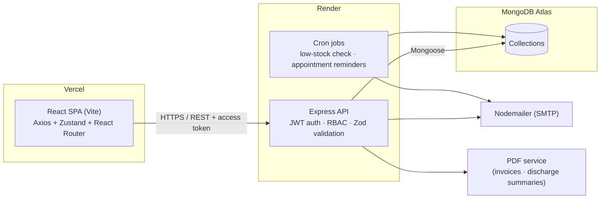
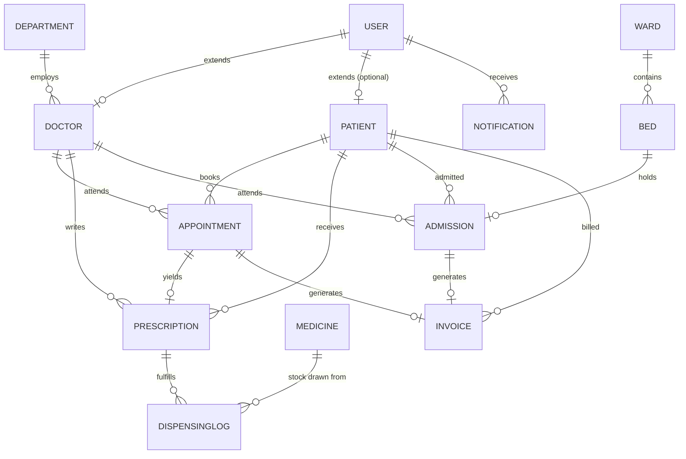

# Meridian Health — Hospital Management System

A full-stack MERN hospital management platform: patient records, doctor/staff
management, appointment scheduling with conflict prevention, admissions,
pharmacy inventory, billing, role-specific analytics, and notifications —
all behind JWT-based role access control (Admin, Doctor, Receptionist, Patient).

## Problem statement

Most small-to-mid hospitals run scheduling on paper or spreadsheets, patient
history in a separate system, and billing in a third — so the same patient
exists as three unrelated records that never reconcile. Meridian Health puts
patients, appointments, admissions, pharmacy, and billing on one schema, so
that a receptionist booking a visit, a doctor writing a prescription, and an
admin reviewing revenue are all reading from the same source of truth, with
access scoped to what each role is actually allowed to see.

## Architecture



### Data model

13 collections. `User` (auth identity) is kept separate from `Doctor`/`Patient`
(role profiles) so a patient record can exist with no login at all — the
common case when a receptionist registers a walk-in.



## Tech stack & trade-offs

| Layer | Choice | Why / trade-off |
|---|---|---|
| Auth | JWT access (15m, in-memory on client) + refresh (7d, httpOnly cookie), rotated on every use | Short-lived access tokens limit exposure if leaked; rotating refresh tokens with server-side revocation on reuse detection avoids the "stolen token works forever" problem of a single long-lived JWT. Trade-off: more moving parts than session cookies alone. |
| Double-booking guard | MongoDB partial unique index on `{doctor, date, startTime}` **plus** an application-level overlap check | The index is the source of truth under concurrent requests (race-safe); the app-level check catches overlapping-but-not-identical slots (e.g. 9:00–9:30 vs 9:15–9:45) that a same-`startTime` index can't see. |
| Validation | Zod on every request body/query, one shared schema style front and back | Runtime-checked, TypeScript-shaped errors without adopting TypeScript itself; schemas are duplicated (not shared as a package) between apps to keep the two deployables independent — a deliberate trade-off for simpler deploys over DRY-ness. |
| PDFs | Generated server-side with `pdfkit`, written to disk and served statically | No headless-browser dependency (no Puppeteer) keeps the Render instance light; trade-off is layout control is more manual than HTML-to-PDF. |
| Frontend state | Zustand for auth/session, React Query-style manual fetch hooks for lists | Zustand avoids Context re-render fan-out for auth; list state is deliberately *not* cached globally since every list page already re-fetches on filter/page change — a full query-cache library would be paying for a problem this app doesn't have yet. |
| 3D/motion | React Three Fiber + drei scoped to `components/three/`, mounted only on the landing and auth pages | Keeps the WebGL/three.js payload out of every dashboard route — those bundles never import it. |
| Testing | Jest + Supertest + `mongodb-memory-server` (backend), Jest + React Testing Library (frontend) | In-memory Mongo means integration tests exercise real Mongoose behavior (indexes, validation) without needing Atlas or Docker in CI. |

## Repository layout

```
backend/   Express API — see backend/src for config, models, routes,
           controllers, services, middleware, validators, jobs
frontend/  React (Vite) SPA — see frontend/src for api, store, components,
           pages (grouped by role), routes, schemas
.github/workflows/backend-ci.yml   Runs backend Jest suite on every push
```

## Getting started

### Prerequisites

- Node.js 18+
- (Optional) A MongoDB Atlas cluster (or any MongoDB 6+ instance) connection
  string — if you skip this, `npm run dev` automatically falls back to a
  temporary in-memory database so the app runs with zero config. That data
  does **not** persist across restarts; set `MONGO_URI` once you have a real
  cluster. Production (`NODE_ENV=production`) always requires `MONGO_URI`.
- (Optional) SMTP credentials for outbound email — the app degrades
  gracefully and skips sending if none are configured

### Backend

```bash
cd backend
cp .env.example .env   # optional — works with zero config, see above
npm install
npm run dev              # http://localhost:5001
npm run seed              # (optional) creates a bootstrap admin account —
                           # run this *while* npm run dev is running if you're
                           # on the in-memory fallback, since seed and dev
                           # would otherwise get two different throwaway DBs
```

Run the test suite (auth flow, appointment conflict logic, billing math):

```bash
npm test
```

### Frontend

```bash
cd frontend
cp .env.example .env    # points at the local API by default
npm install
npm run dev               # http://localhost:5173
```

```bash
npm test
```

### Default roles

- Public self-registration (`/register`) always creates a **patient** account.
- **Doctor**, **receptionist**, and **admin** accounts are provisioned by an
  admin from the Staff / Doctors pages.
- **Running on the zero-config in-memory database** (no `MONGO_URI` set): the
  backend seeds one ready-to-use login per staff role on every startup —
  printed to the console, and reproduced here:

  | Role | Email | Password |
  |---|---|---|
  | Admin | `admin@demo.hms` | `Password123` |
  | Doctor | `doctor@demo.hms` | `Password123` |
  | Receptionist | `receptionist@demo.hms` | `Password123` |
  | Patient | *(register your own at `/register`)* | — |

  This data is thrown away on every restart. Once you point `MONGO_URI` at a
  real cluster, use `npm run seed` instead to create a single bootstrap admin
  (`admin@hms.local` — see console output), then create the rest from the
  Staff / Doctors pages.

## Deployment

- **Frontend** → Vercel (`frontend/` as the project root, `VITE_API_URL`
  pointed at the deployed API)
- **Backend** → Render (`backend/` as the project root, `npm start`, all
  `.env.example` variables set in the dashboard)
- **Database** → MongoDB Atlas

CI (`.github/workflows/backend-ci.yml`) runs the backend Jest suite against
an in-memory MongoDB instance on every push and pull request.

## Screenshots & live demo

_Add screenshots and the deployed URLs here once the app is deployed to
Vercel/Render — e.g._

```markdown


Live demo: https://your-app.vercel.app
```
