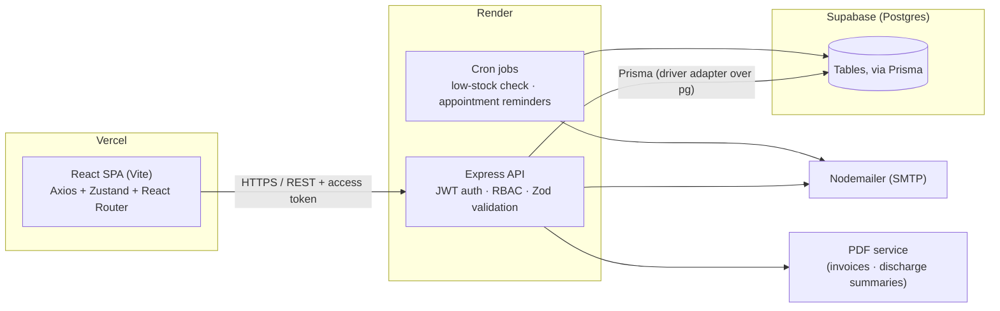
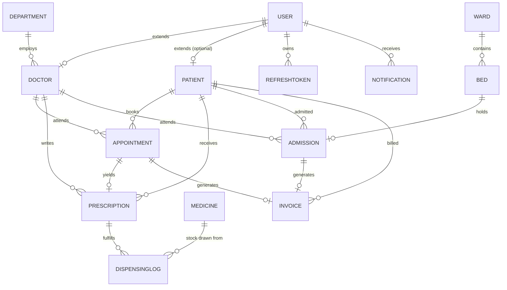

# Meridian Health — Hospital Management System

A full-stack hospital management platform: patient records, doctor/staff
management, appointment scheduling with conflict prevention, admissions,
pharmacy inventory, billing, role-specific analytics, and notifications —
all behind JWT-based role access control (Admin, Doctor, Receptionist, Patient).

## Problem statement

Most small-to-mid hospitals run scheduling on paper or spreadsheets, patient
history in a separate system, and billing in a third — so the same patient
exists as three unrelated records that never reconcile. Meridian Health puts
patients, appointments, admissions, pharmacy, and billing on one schema, so
that a receptionist booking a visit, a doctor writing a prescription, and an
admin reviewing revenue are all reading from the same source of truth, with
access scoped to what each role is actually allowed to see.

## Architecture



### Data model

14 tables. `User` (auth identity) is kept separate from `Doctor`/`Patient`
(role profiles) so a patient record can exist with no login at all — the
common case when a receptionist registers a walk-in. `RefreshToken` is its
own table (not a JSON array on `User`) specifically so rotating a token is a
single atomic row delete, safe under concurrent requests.



Embedded, never-independently-queried structures (a doctor's weekly schedule,
a patient's medical history entries, prescription line items, invoice line
items, a discharge summary) are stored as **JSONB** columns rather than
normalized into their own tables — they're always read and written as a
single blob alongside their parent record, so the extra tables would add
migration complexity for no real benefit.

## Tech stack & trade-offs

| Layer | Choice | Why / trade-off |
|---|---|---|
| Database | Postgres (Supabase), accessed through Prisma with the `@prisma/adapter-pg` driver adapter | Prisma 7 has no built-in engine binary anymore — every connection goes through an explicit driver adapter. Connects via Supabase's **Session Pooler**, not the direct-connection host: the direct host is IPv6-only and would fail to connect from most PaaS hosts (Render included), while the pooler is IPv4-compatible and still supports the prepared statements/advisory locks Prisma migrations need. |
| Auth | JWT access (15m, in-memory on client) + refresh (7d, httpOnly cookie), rotated on every use | Short-lived access tokens limit exposure if leaked; rotating refresh tokens with server-side revocation on reuse detection avoids the "stolen token works forever" problem of a single long-lived JWT. Rotation is a single atomic `DELETE ... RETURNING` on the `RefreshToken` table, safe under concurrent requests (e.g. two browser tabs refreshing at once). |
| Double-booking guard | Postgres **partial unique index** on `(doctorId, date, startTime)` (hand-written migration — Prisma's schema DSL can't express a partial index's `WHERE` clause) **plus** an application-level overlap check | The index is the source of truth under concurrent requests (race-safe); the app-level check catches overlapping-but-not-identical slots (e.g. 9:00–9:30 vs 9:15–9:45) that a same-`startTime` index can't see. |
| API response shape | A small `serialize()` helper reshapes every Prisma result back to `_id`-keyed JSON (matching the original API contract) | Keeps the entire React frontend decoupled from the choice of database/ORM underneath — nothing in `frontend/` needed to change for this migration. |
| Validation | Zod on every request body/query, one shared schema style front and back | Runtime-checked, TypeScript-shaped errors without adopting TypeScript itself; schemas are duplicated (not shared as a package) between apps to keep the two deployables independent — a deliberate trade-off for simpler deploys over DRY-ness. |
| PDFs | Generated server-side with `pdfkit`, written to disk and served statically | No headless-browser dependency (no Puppeteer) keeps the Render instance light; trade-off is layout control is more manual than HTML-to-PDF. |
| Frontend state | Zustand for auth/session, React Query-style manual fetch hooks for lists | Zustand avoids Context re-render fan-out for auth; list state is deliberately *not* cached globally since every list page already re-fetches on filter/page change — a full query-cache library would be paying for a problem this app doesn't have yet. |
| 3D/motion | React Three Fiber + drei scoped to `components/three/`, mounted only on the landing and auth pages | Keeps the WebGL/three.js payload out of every dashboard route — those bundles never import it. |
| Testing | Jest + Supertest against a real Postgres database (backend), Jest + React Testing Library (frontend) | Every table is truncated in `afterEach`, so tests stay independent while exercising the real partial-unique-index and JSONB behavior a mocked/in-memory database couldn't verify. CI spins up a disposable `postgres:16` service container; local `npm test` runs against whatever `DATABASE_URL` is in `backend/.env` (typically the same Supabase project used for `npm run dev`). |

## Repository layout

```
backend/   Express API — see backend/src for config, controllers, services,
           middleware, validators, jobs; backend/prisma for the schema and migrations
frontend/  React (Vite) SPA — see frontend/src for api, store, components,
           pages (grouped by role), routes, schemas
.github/workflows/backend-ci.yml   Runs backend Jest suite (against a CI Postgres container) on every push
render.yaml   Render Blueprint for the backend service
```

## Getting started

### Prerequisites

- Node.js 18+
- A Postgres database — [Supabase](https://supabase.com) free tier works well.
  Use the **Session pooler** connection string (Project Settings → Database →
  Connection String → "Session pooler"), not "Direct connection" — see the
  trade-off table above for why.
- (Optional) SMTP credentials for outbound email — the app degrades
  gracefully and skips sending if none are configured

### Backend

```bash
cd backend
cp .env.example .env      # fill in DATABASE_URL at minimum
npm install                 # also runs `prisma generate` via postinstall
npx prisma migrate deploy   # applies the schema to your database
npm run dev                  # http://localhost:5001
```

In development, the server automatically seeds a demo login for every staff
role on startup (see below) — no separate seed step needed. For a production-
style single bootstrap admin instead, run `npm run seed`.

Run the test suite (auth flow, appointment conflict logic, billing math):

```bash
npm test
```

### Frontend

```bash
cd frontend
cp .env.example .env    # points at the local API by default
npm install
npm run dev               # http://localhost:5173
```

```bash
npm test
```

### Default roles

- Public self-registration (`/register`) always creates a **patient** account.
- **Doctor**, **receptionist**, and **admin** accounts are provisioned by an
  admin from the Staff / Doctors pages.
- **In development**, the backend seeds one ready-to-use login per staff role
  on every startup — printed to the console, and reproduced here:

  | Role | Email | Password |
  |---|---|---|
  | Admin | `admin@demo.hms` | `Password123` |
  | Doctor | `doctor@demo.hms` | `Password123` |
  | Receptionist | `receptionist@demo.hms` | `Password123` |
  | Patient | *(register your own at `/register`)* | — |

  In production (`NODE_ENV=production`), this seeding is skipped — use
  `npm run seed` for a single bootstrap admin (`admin@hms.local` by default —
  see console output), then create the rest from the Staff / Doctors pages.

## Deployment

- **Frontend** → Vercel (`frontend/` as the project root, `VITE_API_URL`
  pointed at the deployed API)
- **Backend** → Render, via the included `render.yaml` Blueprint
  (`backend/` as the root directory, build runs `prisma migrate deploy`
  automatically, `npm start` to run). Set `DATABASE_URL` (Supabase Session
  Pooler string), `CLIENT_URL`, and the SMTP variables in the Render
  dashboard — `JWT_ACCESS_SECRET`/`JWT_REFRESH_SECRET` are auto-generated by
  the Blueprint.
- **Database** → Supabase (Postgres)

CI (`.github/workflows/backend-ci.yml`) runs the backend Jest suite against a
disposable `postgres:16` service container on every push and pull request.

## Screenshots & live demo

_Add screenshots and the deployed URLs here once the app is deployed to
Vercel/Render — e.g._

```markdown


Live demo: https://your-app.vercel.app
```
